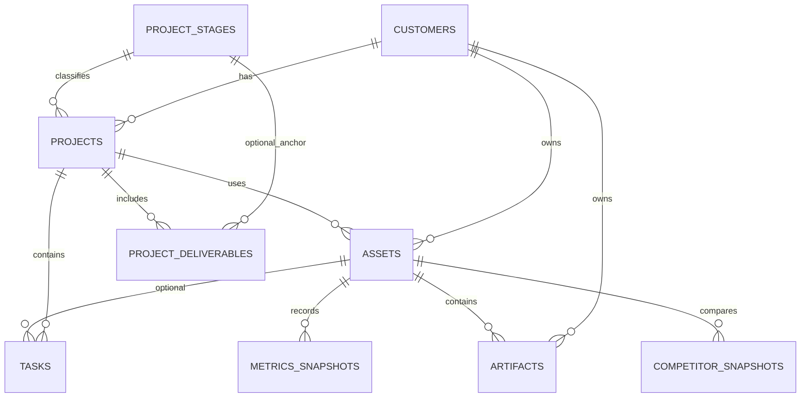

# BW-CRM Schema v1 — AGREED

**Status:** v1 migrations applied on remote `uvgzchkejlrqrgiorvwf` (2026-07-20).  
**Source:** `new-schema.md` (FigJam transcription) + planning review 2026-07-20.  
**Reference stack:** sibling `crm-100up` (Vite React + Supabase migrations) — patterns only, not domain tables.

### Applied remote migrations

| Remote name | Local file |
|---|---|
| `drop_demo_schema` | `20260720010001_drop_demo_schema.sql` |
| `core_schema` | `20260720010002_core_schema.sql` |
| `rls` | `20260720010003_rls.sql` |
| `functions_triggers` | `20260720010004_functions_triggers.sql` |
| `profiles` | `20260720130001_profiles.sql` |
| `add_managed_website_asset_type` | `20260720200001_add_managed_website_asset_type.sql` |
| `competitor_runs` | `20260720200002_competitor_runs.sql` |

Combined paste file (reference only): `supabase/apply_v1.sql`.

Tags used below:

| Tag | Meaning |
|---|---|
| **AGREED** | Implement in v1 migrations |
| **PARKED** | Designed extension point; do not build yet |
| **OUT** | Explicitly not in this product |

---

## Global conventions (AGREED)

| Rule | Choice |
|---|---|
| Primary keys | `bigint generated by default as identity` — column name `id` on every table |
| Foreign keys | `{table_singular}_id` (e.g. `customer_id`, `asset_id`, `project_id`) |
| Timestamps | `timestamptz not null default now()` for `created_at` / `updated_at` |
| Optimistic lock | `version integer not null default 1` + bump trigger (100up pattern) on mutable entities |
| Status / type lists | Postgres `enum` or `text` + `check` — no free-text drift |
| RLS | Enabled on all `public` tables from day one (solo admin is fine; policies tighten later) |
| Migrations | `supabase/migrations/` only — retire ad-hoc `setup-supabase*.sql` after cutover |
| Data cutover | Drop/recreate public tables; no migrate-in-place of demo rows |

---

## Decision log (from `new-schema.md` issues)

| # | Issue | Decision |
|---|---|---|
| 1 | Circular `projects.asset_id` ↔ `assets.project_id` | **AGREED** — remove `projects.asset_id`. Project has many assets via `assets.project_id` only. |
| 2 | `tasks.customer_id` marked PK in FigJam | **AGREED** — FK only, nullable. Prefer join via project; denorm allowed for filters. |
| 3 | Stage/step naming on projects | **AGREED** — columns `stage` + `step`, composite FK → `project_stages(stage, step)`. |
| 4 | Deliverable as PK | **AGREED** — descriptive `title` field; PK is `id`. |
| 5 | `assets_id` vs `asset_id` | **AGREED** — PK `id`; FK column name `asset_id`. |
| 6 | Duplicate session-duration fields | **AGREED** — `avg_session_duration` + `avg_session_duration_delta` (GA4, not GSC). |
| 7 | Competitor snap PK name clash | **AGREED** — table `competitor_snapshots`, PK `id`. |
| 8 | Stock / solar entities on FigJam | **OUT** — ignore for BW-CRM. |

---

## Entity relationship (v1)



---

## Enums (AGREED)

```text
customer_lifecycle   : lead | customer | inactive
deliverable_type     : goal_target | collection_of_work | guaranteed_outcome
deliverable_status   : planned | in_progress | done | dropped
task_status          : not_started | in_progress | blocked | completed
task_type            : task | agent_task | internal
asset_type           : managed_website | website | staging | other
competitor_run_status: pending | running | done | failed
artifact_type        : report | data | proposal | other
artifact_status      : draft | final | archived
content_type         : link | md | json | csv | other
snapshot_type        : baseline | update
competitor_type      : competitor | target | business
connection_status    : unknown | connected | error | disconnected
```

---

## Tables

### `customers` — AGREED

Business-first (agency CRM), not person-only.

| Column | Type | Notes |
|---|---|---|
| `id` | `bigint` PK | |
| `business_name` | `text not null` | Card title / primary label |
| `contact_first_name` | `text not null default ''` | |
| `contact_last_name` | `text not null default ''` | |
| `email` | `text not null default ''` | |
| `phone` | `text not null default ''` | |
| `address` | `text not null default ''` | |
| `location` | `text not null default ''` | City / region shorthand |
| `website` | `text not null default ''` | Marketing site URL (may differ from asset URL) |
| `contact_method` | `text not null default 'Email'` | |
| `lifecycle` | `customer_lifecycle not null default 'lead'` | **Not** delivery pipeline — renamed from FigJam `stage` |
| `notes` | `text not null default ''` | |
| `version` | `integer not null default 1` | |
| `created_at` / `updated_at` | `timestamptz` | |

---

### `project_stages` — AGREED

100up `pipeline_steps` pattern. Composite PK makes invalid (stage, step) impossible.

| Column | Type | Notes |
|---|---|---|
| `stage` | `smallint not null` | PK part |
| `step` | `smallint not null` | PK part |
| `stage_name` | `text not null` | |
| `step_name` | `text not null` | |
| `ordinal` | `smallint not null unique` | Board column / advance order |

**Seed (v1 — from current `crm.html` STAGES, one step each; refine later):**

| stage | step | stage_name | step_name | ordinal |
|---|---|---|---|---|
| 1 | 0 | Proposal | Active | 0 |
| 2 | 0 | Onboard & Design | Active | 1 |
| 3 | 0 | Build | Active | 2 |
| 4 | 0 | Review | Active | 3 |
| 5 | 0 | Refine | Active | 4 |
| 6 | 0 | Live | Active | 5 |
| 7 | 0 | Closed | Active | 6 |

Sub-steps can be added later without changing the FK shape.

---

### `projects` — AGREED

| Column | Type | Notes |
|---|---|---|
| `id` | `bigint` PK | |
| `customer_id` | `bigint not null` FK → `customers` | |
| `name` | `text not null` | **Added** — pipeline card title |
| `system_description` | `text not null default ''` | Longer brief / scope |
| `stage` / `step` | `smallint not null` | Composite FK → `project_stages`; default `(1, 0)` |
| `notes` | `text not null default ''` | |
| `proposal` | `text not null default ''` | Proposal copy / summary |
| `proposal_artifact_id` | `bigint null` FK → `artifacts` | Prefer FK over bare URL; nullable until artifact exists |
| `start_on` | `date null` | Renamed from `start` (reserved word) |
| `deadline` | `date null` | |
| `completed_on` | `date null` | |
| `version` | `integer not null default 1` | |
| `created_at` / `updated_at` | `timestamptz` | |

**OUT:** `projects.asset_id` (circular).

---

### `project_deliverables` — AGREED

Proposal outcomes — not tasks, not milestones.

| Column | Type | Notes |
|---|---|---|
| `id` | `bigint` PK | |
| `project_id` | `bigint not null` FK → `projects` on delete cascade | |
| `title` | `text not null` | Was FigJam `deliverable` |
| `type` | `deliverable_type not null` | |
| `status` | `deliverable_status not null default 'planned'` | |
| `stage` / `step` | `smallint null` | Optional anchor to pipeline; composite FK when set |
| `created_at` / `updated_at` | `timestamptz` | |

---

### `assets` — AGREED

Integration hub. Connection *status* + Hermes *pointers* on the row for v1 UI; secrets stay out.

| Column | Type | Notes |
|---|---|---|
| `id` | `bigint` PK | |
| `customer_id` | `bigint not null` FK → `customers` | |
| `project_id` | `bigint null` FK → `projects` | **Current project** for this asset. Nullable. Later: many related projects (junction) + this column stays current |
| `asset_type` | `asset_type not null default 'managed_website'` | `managed_website` = live site; `website` = proposal-stage URL |
| `name` | `text not null default ''` | Display label (e.g. "Live site") |
| `asset_url` | `text not null default ''` | |
| `health_score` | `numeric null` | DataForSEO / audit score when available |
| `conversion_event_name` | `text not null default ''` | GA4 event used for `conversions` in snapshots |
| `gsc_status` | `connection_status not null default 'unknown'` | |
| `ga4_status` | `connection_status not null default 'unknown'` | |
| `wp_cli_status` | `connection_status not null default 'unknown'` | |
| `hermes_profile` | `text not null default ''` | Pointer only |
| `telegram_topic` | `text not null default ''` | Pointer only |
| `workspace` | `text not null default ''` | Hermes workspace name if needed |
| `version` | `integer not null default 1` | |
| `created_at` / `updated_at` | `timestamptz` | |

**PARKED — `asset_connections`:** provider (`gsc` \| `ga4` \| `dataforseo` \| `wp_mcp` \| `hermes` \| `openrouter`), `status`, `config jsonb` (non-secret), `last_sync_at`. Secrets in Edge Function env / vault, not columns.

---

### `tasks` — AGREED

| Column | Type | Notes |
|---|---|---|
| `id` | `bigint` PK | |
| `project_id` | `bigint null` FK → `projects` | Prefer set; null = customer/internal-only |
| `asset_id` | `bigint null` FK → `assets` | |
| `customer_id` | `bigint null` FK → `customers` | Denorm for filters; not a second PK |
| `title` | `text not null` | Was `task_title` |
| `notes` | `text not null default ''` | |
| `status` | `task_status not null default 'not_started'` | |
| `task_type` | `task_type not null default 'task'` | `agent_task` reserved for Hermes |
| `due_on` | `date null` | |
| `assigned_to` | `text not null default ''` | Free text until profiles exist |
| `version` | `integer not null default 1` | |
| `created_at` / `updated_at` | `timestamptz` | |

**PARKED — `agent_runs`:** `task_id`, `proposed_by`, `approved_by`, `approved_at`, `status` (`proposed` \| `approved` \| `rejected` \| `running` \| `done` \| `failed`), `payload jsonb`, `result jsonb`. Hermes may create `agent_task` rows; nothing executes without an approved run.

---

### `artifacts` — AGREED

| Column | Type | Notes |
|---|---|---|
| `id` | `bigint` PK | |
| `customer_id` | `bigint not null` FK → `customers` | |
| `asset_id` | `bigint null` FK → `assets` | |
| `project_id` | `bigint null` FK → `projects` | Useful for proposal artifacts |
| `title` | `text not null` | |
| `artifact_type` | `artifact_type not null default 'other'` | |
| `status` | `artifact_status not null default 'draft'` | |
| `summary` | `text not null default ''` | |
| `content_type` | `content_type not null default 'link'` | |
| `path_or_url` | `text not null default ''` | |
| `bytes` | `bigint null` | |
| `version` | `integer not null default 1` | |
| `created_at` / `updated_at` | `timestamptz` | |

Note: `projects.proposal_artifact_id` → `artifacts.id` is a soft cycle at create time — create artifact first (or leave FK null until linked). No DB circular FK between projects↔assets.

---

### `metrics_snapshots` — AGREED

Wide row for dashboard cards. Source notes corrected (GSC vs GA4).

| Column | Type | Notes |
|---|---|---|
| `id` | `bigint` PK | |
| `asset_id` | `bigint not null` FK → `assets` on delete cascade | |
| `period_label` | `text not null` | e.g. `2026-Q2`, `2026-07` |
| `snapshot_type` | `snapshot_type not null default 'update'` | |
| `domain_rank` / `_delta` | `numeric null` | DataForSEO |
| `clicks` / `_delta` | `numeric null` | GSC |
| `impressions` / `_delta` | `numeric null` | GSC |
| `ctr` / `_delta` | `numeric null` | GSC |
| `avg_rank` / `_delta` | `numeric null` | GSC (average position) |
| `conversions` / `_delta` | `numeric null` | GA4 — event name on asset |
| `engagement_rate` / `_delta` | `numeric null` | **GA4** (was mislabelled GSC) |
| `avg_session_duration` / `_delta` | `numeric null` | **GA4** |
| `version` | `integer not null default 1` | |
| `created_at` / `updated_at` | `timestamptz` | |

---

### `competitor_snapshots` — AGREED

| Column | Type | Notes |
|---|---|---|
| `id` | `bigint` PK | |
| `asset_id` | `bigint not null` FK → `assets` on delete cascade | Subject asset being compared |
| `type` | `competitor_type not null` | `competitor` \| `target` \| `business` |
| `business_name` | `text not null` | |
| `url` | `text not null default ''` | |
| `location` | `text not null default ''` | |
| `notes` | `text not null default ''` | |
| `total_keywords` | `numeric null` | |
| `organic_traffic` | `numeric null` | |
| `traffic_value` | `numeric null` | |
| `paid_traffic` | `numeric null` | |
| `top_3_keywords` | `numeric null` | |
| `top_10_keywords` | `numeric null` | |
| `position_1` | `numeric null` | |
| `position_2_3` | `numeric null` | |
| `position_4_10` | `numeric null` | |
| `position_11_20` | `numeric null` | |
| `keyword_gaps` | `numeric null` | |
| `backlinks` | `numeric null` | |
| `referring_domains` | `numeric null` | |
| `domain_rank` | `numeric null` | |
| `spam_score` | `numeric null` | |
| `run_id` | `bigint null` FK → `competitor_analysis_runs` | Groups rows from one analysis run |
| `top_100_keywords` | `numeric null` | |
| `position_21_50` | `numeric null` | |
| `position_51_100` | `numeric null` | |
| `version` | `integer not null default 1` | |
| `created_at` / `updated_at` | `timestamptz` | |

---

### `competitor_analysis_runs` — AGREED (2026-07-20)

| Column | Type | Notes |
|---|---|---|
| `id` | `bigint` PK | |
| `asset_id` | `bigint not null` FK → `assets` on delete cascade | Subject asset |
| `search_location_code` | `integer not null default 2036` | DataForSEO location code |
| `search_location_name` | `text not null default 'Australia'` | Display label |
| `search_language_code` | `text not null default 'en'` | |
| `competitor_inputs` | `jsonb not null default '[]'` | Competitor form inputs (not target) |
| `status` | `competitor_run_status not null default 'pending'` | |
| `error_message` | `text not null default ''` | Set on `failed` |
| `version` | `integer not null default 1` | |
| `created_at` / `updated_at` | `timestamptz` | |

---

## PARKED (document only — no v1 tables)

| Future table / concern | Intent |
|---|---|
| `asset_connections` | Pluggable GSC / GA4 / DataForSEO / WP MCP / Hermes / OpenRouter without more schema churn |
| `agent_runs` | Hermes propose → human approve → execute |
| `wp_command_log` | Audit one-click / MCP WP CLI executions |
| `profiles` + auth roles | When multi-user; until then `assigned_to` text is enough |
| Email API / OpenRouter | Edge Functions + secrets; no core CRM columns yet |
| Stock / suppliers / POs | **OUT** (100up domain) |

---

## Implementation order (next)

1. ~~Init `supabase/` + write migrations.~~ **Done**
2. ~~Apply to remote `uvgzchkejlrqrgiorvwf`.~~ **Done**
3. ~~Generate TypeScript types + scaffold Vite React `app/`.~~ **Done** — run `cd app && npm run dev`
4. ~~Pipeline UI over `projects` + `project_stages`.~~ **Done** (empty board until data seeded)
5. Tasks list + create form
6. Assets view + integration status
7. Full `database.types.ts` regen via Supabase MCP when schema changes

`new-schema.md` remains the FigJam transcript. **This file is the implementation contract.**

### Local dev

```bash
cd app
cp .env.example .env.local   # or use existing .env.local
npm install
npm run dev
```

Sign in with a Supabase Auth user on project `uvgzchkejlrqrgiorvwf`. RLS requires `authenticated` — anon cannot read tables.
