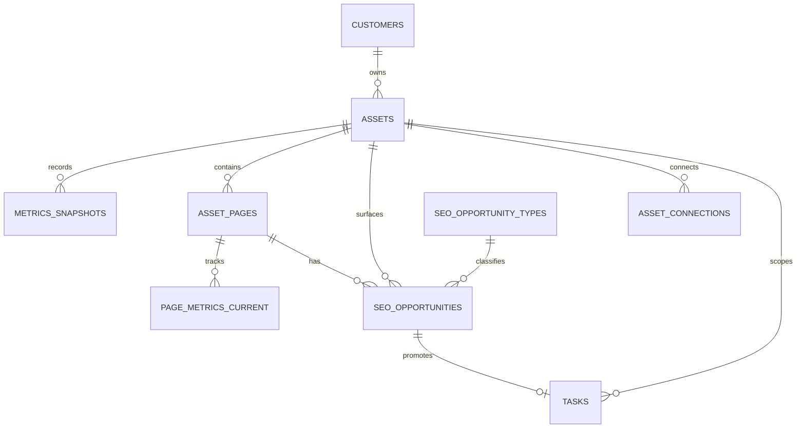

# SEO schema v2 — extension proposal

**Status:** draft · **Extends:** [`docs/schema-v1.md`](../schema-v1.md) (does not replace it)  
**Features:** [`FEATURES.md`](FEATURES.md)

Tags: **PROPOSED** · **PARKED** (already in v1 doc)

---

## Principles

1. **Site rollup** stays on existing `metrics_snapshots` (v1 AGREED).
2. **Page-level** data gets its own tables — do not bloat `metrics_snapshots`.
3. **Opportunities** reference pages via FK; multiple rows per page allowed.
4. **No raw GSC exports** — only aggregated current metrics + `evidence_json` on opportunities.
5. **Secrets** stay out of tables — `asset_connections` holds pointers; vault holds tokens.

---

## Entity relationship (v2 SEO)



---

## New enums (PROPOSED)

```text
seo_opportunity_priority : high | medium | low
seo_opportunity_status   : open | task_created | complete | dismissed | snoozed
seo_opportunity_type     : low_ctr | page_speed | striking_distance | content_refresh
                         | serp_gap | indexation | thin_content | internal_link | other
sync_direction           : pull | push | bidirectional
sync_status              : idle | running | ok | error
```

Reuse v1 `connection_status` on `asset_connections`.

---

## `asset_pages` — PROPOSED

Canonical page registry per managed asset. Synced from GSC page list + WordPress posts.

| Column | Type | Notes |
|---|---|---|
| `id` | `bigint` PK | |
| `asset_id` | `bigint not null` FK → `assets` on delete cascade | |
| `url_path` | `text not null` | Normalized path, e.g. `/our-systems/` |
| `canonical_url` | `text not null default ''` | Full URL if needed |
| `wp_post_id` | `bigint null` | WP `posts.ID` when matched |
| `wp_post_type` | `text not null default ''` | post, page, … |
| `title` | `text not null default ''` | From WP or GSC |
| `is_priority` | `boolean not null default false` | Manual or rule flag |
| `workflow` | `text not null default ''` | SCOS / custom meta |
| `indexation_status` | `text not null default ''` | e.g. indexed, noindex, unknown |
| `cluster_slug` | `text not null default ''` | ALTC cluster |
| `topic_slug` | `text not null default ''` | ALTC topic |
| `meta_synced_at` | `timestamptz null` | Last WP meta pull |
| `version` | `integer not null default 1` | |
| `created_at` / `updated_at` | `timestamptz` | |

**Unique:** `(asset_id, url_path)`

**Indexes:** `(asset_id, is_priority)`, `(asset_id, wp_post_id)` where not null

---

## `page_metrics_current` — PROPOSED

One row per page — latest 28-day GSC window. Replaced on each scan (not append-only).

| Column | Type | Notes |
|---|---|---|
| `id` | `bigint` PK | |
| `asset_page_id` | `bigint not null` FK → `asset_pages` on delete cascade | |
| `period_start` | `date not null` | |
| `period_end` | `date not null` | |
| `prior_period_start` | `date null` | For delta calculation |
| `prior_period_end` | `date null` | |
| `impressions` | `numeric not null default 0` | |
| `impressions_delta` | `numeric not null default 0` | |
| `clicks` | `numeric not null default 0` | |
| `clicks_delta` | `numeric not null default 0` | |
| `ctr` | `numeric not null default 0` | Percentage 0–100 |
| `ctr_delta` | `numeric not null default 0` | Percentage points |
| `avg_position` | `numeric not null default 0` | |
| `avg_position_delta` | `numeric not null default 0` | Negative = improved |
| `pulled_at` | `timestamptz not null default now()` | |
| `version` | `integer not null default 1` | |
| `created_at` / `updated_at` | `timestamptz` | |

**Unique:** `(asset_page_id)` — one current row per page

**Volume estimate:** ~50–500 rows per asset, not millions.

---

## `seo_opportunities` — PROPOSED

Action queue rows. Denormalized metrics copied at detection time (like SEO OS) so sorting/filtering does not require joins for list views.

| Column | Type | Notes |
|---|---|---|
| `id` | `bigint` PK | |
| `asset_id` | `bigint not null` FK → `assets` | Denorm for asset filter |
| `asset_page_id` | `bigint not null` FK → `asset_pages` | |
| `opportunity_type` | `seo_opportunity_type not null` | |
| `problem` | `text not null` | Generated string, e.g. “CTR 1.9% on 10412 impr — ~196 clicks/mo lost” |
| `priority` | `seo_opportunity_priority not null` | |
| `recommended_workflow` | `text not null default ''` | e.g. “Low-CTR title/meta update” |
| `status` | `seo_opportunity_status not null default 'open'` | |
| `impressions` | `numeric not null default 0` | Snapshot at detection |
| `clicks` | `numeric not null default 0` | |
| `ctr` | `numeric not null default 0` | |
| `avg_position` | `numeric not null default 0` | |
| `impact_score` | `numeric null` | Optional sort key (lost clicks, etc.) |
| `evidence_json` | `jsonb not null default '{}'` | Thresholds, benchmarks, top queries ( capped ) |
| `task_id` | `bigint null` FK → `tasks` | Set when promoted |
| `detected_at` | `timestamptz not null default now()` | |
| `resolved_at` | `timestamptz null` | |
| `version` | `integer not null default 1` | |
| `created_at` / `updated_at` | `timestamptz` | |

**Unique (soft dedup):** `(asset_page_id, opportunity_type, status)` where `status = 'open'` — or use natural key hash in application layer.

**Indexes:** `(asset_id, status, priority)`, `(asset_page_id)`, `(status, priority)` 

**Multiple rows per page:** allowed — different `opportunity_type` values.

---

## `asset_connections` — PROPOSED (was PARKED in v1)

| Column | Type | Notes |
|---|---|---|
| `id` | `bigint` PK | |
| `asset_id` | `bigint not null` FK → `assets` | |
| `provider` | `text not null` | `gsc`, `ga4`, `wordpress`, `hermes`, `dataforseo`, `ssh` |
| `status` | `connection_status not null default 'unknown'` | |
| `config` | `jsonb not null default '{}'` | Non-secret: property ID, site URL, meta key map |
| `secret_ref` | `text not null default ''` | Vault secret name / Edge env key — **not** the secret |
| `last_sync_at` | `timestamptz null` | |
| `last_error` | `text not null default ''` | |
| `version` | `integer not null default 1` | |
| `created_at` / `updated_at` | `timestamptz` | |

**Unique:** `(asset_id, provider)`

---

## Extensions to existing v1 tables

### `tasks` — add columns (PROPOSED)

| Column | Type | Notes |
|---|---|---|
| `seo_opportunity_id` | `bigint null` FK → `seo_opportunities` | Source opportunity |
| `page_url` | `text not null default ''` | Denorm path for list views |
| `agent_skill` | `text not null default ''` | PARKED until Hermes — e.g. `seo-page`, `breakdance-design-system` |

### `metrics_snapshots` — no change

Continue using for **site-level** 28-day cards. Job writes one row per refresh; UI reads latest by `asset_id` + `created_at`.

Optional convention: `period_label = 'Last 28 days'`, `snapshot_type = 'update'`.

---

## PARKED (document only)

| Table | Intent |
|---|---|
| `page_metrics_snapshots` | Historical page metrics if trending needed |
| `seo_opportunity_rules` | DB-stored thresholds; v1 can live in Edge Function config |
| `agent_runs` | Already PARKED in v1 |
| `wp_command_log` | Already PARKED in v1 |
| `seo_scan_runs` | Job audit: started_at, rows_upserted, errors |
| `activity_events` | SEO OS parity for agent activity feed |

---

## Opportunity rule engine (logic, not tables)

Runs as **script** after GSC page metrics upsert. Example rules:

| Type | Condition (illustrative) | Priority |
|---|---|---|
| `low_ctr` | impressions ≥ 1000 AND ctr below expected for position band | high |
| `striking_distance` | avg_position 11–20 AND impressions ≥ 500 | medium |
| `page_speed` | CWV field data fails threshold (future: PageSpeed API) | high |
| `indexation` | WP meta says indexed but GSC shows no impressions 90d | medium |

Problem string template:

```text
CTR {ctr}% on {impressions} impr — ~{lost_clicks} clicks/mo lost
```

Expected CTR bands: script lookup by position (no LLM).

On each scan:

1. Upsert `page_metrics_current`
2. For each rule → upsert or skip open `seo_opportunities`
3. Mark opportunities **dismissed** if condition no longer met (optional policy)

---

## SEO OS column mapping

| SEO OS `opportunities` | BW-CRM v2 |
|---|---|
| `client_id` | `asset_id` (+ join to customer) |
| `page` | `asset_pages.url_path` / `canonical_url` |
| `opportunity_type` | `seo_opportunity_type` enum |
| `impact`, `confidence`, `effort` | Fold into `impact_score` + `evidence_json` (simpler) |
| `recommended_workflow` | same |
| `evidence_json` | same |
| `status` | `seo_opportunity_status` |

---

## Migration order (when implementing)

1. `asset_connections` + vault wiring
2. `asset_pages` + WP read sync
3. `page_metrics_current` + GSC page pull
4. `seo_opportunities` + rule engine
5. `tasks.seo_opportunity_id` + promote UI
