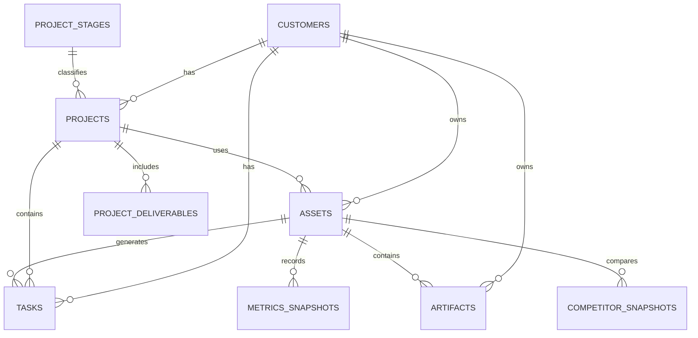

# Brighter Websites Database Schema

> Transcribed from the linked FigJam node. Field names have been normalised to `snake_case`, obvious spelling errors have been corrected, and unspecified data types are marked `TBD` rather than guessed.
>
> **Implementation contract:** [`docs/schema-v1.md`](docs/schema-v1.md) (AGREED). This file is the FigJam transcript only.

## Entity Relationship Overview

## `customers`

| Field | Type | Key | Notes |
|---|---|---|---|
| `customer_id` | `int` | PK | |
| `first_name` | `string` | | |
| `last_name` | `string` | | |
| `address` | `string` | | |
| `phone` | `string` | | |
| `email` | `string` | | |
| `contact_method` | `string` | | |
| `version` | `int` | | |
| `created_at` | `datetime` | | |
| `updated_at` | `datetime` | | |
| `stage` | `string` | | list: lead, customer, inactive|

## `projects`

| Field | Type | Key | Notes |
|---|---|---|---|
| `project_id` | `int` | PK | |
| `customer_id` | `int` | FK | References `customers.customer_id` |
| `system_description` | `string` | | |
| `asset_id` | `int` | FK | References `assets.assets_id` |
| `project_stage` | `int` | FK | References a stage identifier |
| `project_step` | `int` | FK | References step identifier |
| `notes` | `string` | | |
| `version` | `int` | | |
| `created_at` | `datetime` | | |
| `updated_at` | `datetime` | | |
| `proposal` | `string` | | |
| `proposal_artefact` | `TBD` | | Either a url or maybe link to artefact table|
| `start` | `datetime` | | |
| `deadline` | `datetime` | | |

## `project_deliverables`

High level items included in a project proposal. Not Necessarily tasks but more like outcomes to be achieved, not quite milestones.

| Field | Type | Key | Notes |
|---|---|---|---|
| `id` | `int` | PK | |
| `project_id` | `int` | FK | References `projects.project_id` |
| `deliverable` | `string` |   |  |
| `project_stage` | `int` | FK | References a stage identifier |
| `project_step` | `int` | FK | References step identifier |
| `created_at` | `datetime` | | |
| `updated_at` | `datetime` | | |
| `status` | `string` | | |
| `type` | `string` | | List Goal/Target, Collection of Work, Guaranteed Outcome|

## `tasks`

Things to be done.

| Field | Type | Key | Notes |
|---|---|---|---|
| `id` | `int` | PK | |
| `project_id` | `int` | FK | References `projects.project_id` |
| `asset_id` | `int` | FK | References `assets.assets_id` |
| `customer_id` | `int` | FK | References `customers.customer_id` |
| `task_title` | `string` | | |
| `notes` | `string` | | |
| `created_at` | `datetime` | | |
| `updated_at` | `datetime` | | |
| `status` | `string` | | List:  Not Started, In Progress, Blocked, Completed|
| `task_type` | `string` | | List: Task, Agent Task, Internal Task - agent tasks might need own table for approval flow?|

## `project_stages`

| Field | Type | Key | Notes |
|---|---|---|---|
| `stage` | `int` | PK | |
| `step` | `int` | PK | Composite key with `stage` |
| `stage_name` | `string` | | |
| `step_name` | `string` | | |
| `ordinal` | `int` | UK | Unique ordering value |

## `assets`

| Field | Type | Key | Notes |
|---|---|---|---|
| `asset_id` | `int` | PK | |
| `asset_type` | `int` | | |
| `customer_id` | `int` | FK | References `customers.customer_id` |
| `project_id` | `int` | FK | References `projects.project_id` |
| `asset_url` | `TBD` | |  a url link field|
| `health_score` | `string` | | Using DataforSEO data or like AHRefs Site Audit health score |
| `gsc_status` | `string` | | Google Search Console connection |
| `ga4_status` | `string` | | Google Analytics 4 connection status |
| `wp_cli_status` | `string` | | connection to wp CLI connection status |
| `hermes_profile` | `string` | | the hermes profile assigned to this asset|
| `telegram_topic` | `string` | | the hermes telegram topic assiged to this asset|
| `workspace` | `string` | | hermes workspace name if needed|
| `version` | `int` | | |
| `created_at` | `datetime` | | |
| `updated_at` | `datetime` | | |

## `metrics_snapshots`

| Field | Type | Key | Notes |
|---|---|---|---|
| `metrics_snap_id` | `int` | PK | |
| `asset_id` | `int` | FK | References `assets.assets_id` |
| `period_label` | `string` | | |
| `domain_rank` | `TBD` | | dataforseo data number|
| `domain_rank_delta` | `TBD` | | |
| `clicks` | `TBD` | | GSC data num|
| `clicks_delta` | `TBD` | | |
| `impressions` | `TBD` | | GSC data num |
| `impressions_delta` | `TBD` | | |
| `ctr` | `TBD` | | GSC data num % |
| `ctr_delta` | `TBD` | | |
| `avg_rank` | `TBD` | | GSC data num |
| `avg_rank_delta` | `TBD` | | |
| `conversions` | `TBD` | | GA4 data num need to be able to set what the conversion event name should be specifically |
| `conversions_delta` | `TBD` | | |
| `engagement_rate` | `TBD` | | GSC data num %|
| `engagement_rate_delta` | `TBD` | | |
| `avg_session_duration` | `TBD` | | GSC data num |
| `avg_session_duration_delta` | `TBD` | | |
| `version` | `int` | | |
| `created_at` | `datetime` | | |
| `updated_at` | `datetime` | | |
| `snapshot_type` | `enum` | | `baseline` or `update` |

## `artifacts`

| Field | Type | Key | Notes |
|---|---|---|---|
| `artifact_id` | `int` | PK | |
| `asset_id` | `int` | FK | References `assets.assets_id` |
| `customer_id` | `int` | FK | References `customers.customer_id` |
| `title` | `string` | | |
| `artifact_type` | `TBD` | | list: Report, data |
| `status` | `string` | | |
| `summary` | `string` | | |
| `content_type` | `string` | | list, link, md, json, csv etc  |
| `path_or_url` | `TBD` | | |
| `bytes` | `TBD` | | |
| `version` | `int` | | |
| `created_at` | `datetime` | | |
| `updated_at` | `datetime` | | |

## `competitor_snapshots`

| Field | Type | Key | Notes |
|---|---|---|---|
| `competitor_snap_id` | `int` | PK | Consider renaming to `competitor_snapshot_id` |
| `business_name` | `string` | | |
| `url` | `TBD` | | |
| `location` | `string` | | |
| `notes` | `string` | | |
| `asset_id` | `int` | FK | The related asset this snapshot is compared with |
| `type` | `enum` | | `competitor`, `target`, or `business` |
| `total_keywords` | `TBD` | | |
| `organic_traffic` | `TBD` | | |
| `traffic_value` | `TBD` | | |
| `paid_traffic` | `TBD` | | |
| `top_3_keywords` | `TBD` | | |
| `top_10_keywords` | `TBD` | | |
| `position_1` | `TBD` | | |
| `position_2_3` | `TBD` | | |
| `position_4_10` | `TBD` | | |
| `position_11_20` | `TBD` | | |
| `keyword_gaps` | `TBD` | | |
| `backlinks` | `TBD` | | |
| `referring_domains` | `TBD` | | |
| `domain_rank` | `TBD` | | |
| `spam_score` | `TBD` | | |
| `version` | `int` | | |
| `created_at` | `datetime` | | |
| `updated_at` | `datetime` | | |

## Relationships

| Parent | Child | Relationship |
|---|---|---|
| `customers` | `projects` | One customer can have many projects |
| `customers` | `tasks` | One customer can have many tasks |
| `customers` | `assets` | One customer can have many assets |
| `customers` | `artifacts` | One customer can have many artifacts |
| `projects` | `tasks` | One project can have many tasks |
| `projects` | `project_deliverables` | One project can have many deliverables |
| `projects` | `assets` | One project can have many assets |
| `project_stages` | `projects` | A stage and step classify project progress |
| `assets` | `tasks` | One asset can have many tasks |
| `assets` | `artifacts` | One asset can have many artifacts |
| `assets` | `metrics_snapshots` | One asset can have many metric snapshots |
| `assets` | `competitor_snapshots` | One asset can have many competitor comparison snapshots |

## Schema Issues to Resolve Before Implementation

1. **Circular project and asset references**  
   `projects.asset_id` and `assets.project_id` create a circular dependency. Decide whether:
   - No: each project has one primary asset, while assets also belong to projects, or
   - Decision = YES the project should simply have many assets and `projects.asset_id` should be removed.

2. **Task customer key**  
   `tasks.customer_id` is marked as a primary key in FigJam. It should probably be an FK only.

3. **Project stage references**  
   `projects.stage_name` and `projects.step_name` are typed as integers. These should probably be renamed to `stage_id` and `step_id`, or replaced with a single `project_stage_id`.

4. **Project deliverable key**  
   Both `id` and `deliverable` are marked as primary keys. Confirm whether this is a composite key or whether `deliverable` should be a descriptive field.
   Decision =`deliverable` should be a descriptive field.

5. **Inconsistent asset ID naming and types**  
   The assets PK is `assets_id`, while other tables use `asset_id`. Some source types are `string`, while the PK is `int`.
   Decision = asset_id int as FK usage

6. **Duplicate session duration field**  
   The metrics table contains `Avg Session Durration_delta` twice. This transcription assumes the first was intended to be `avg_session_duration`.
   decision =`avg_session_duration`+ `Avg Session Durration_delta`

7. **Competitor snapshot primary key**  
   The table uses `metrics_snap_id`, which duplicates the metrics snapshot naming. A dedicated `competitor_snapshot_id` would be clearer.

8. **Missing stock entities**  
   The board is titled “Solar Jobs and Stock Database”, but this node does not include stock, supplier, product, inventory, purchase order, or stock movement tables.
   Igrnore